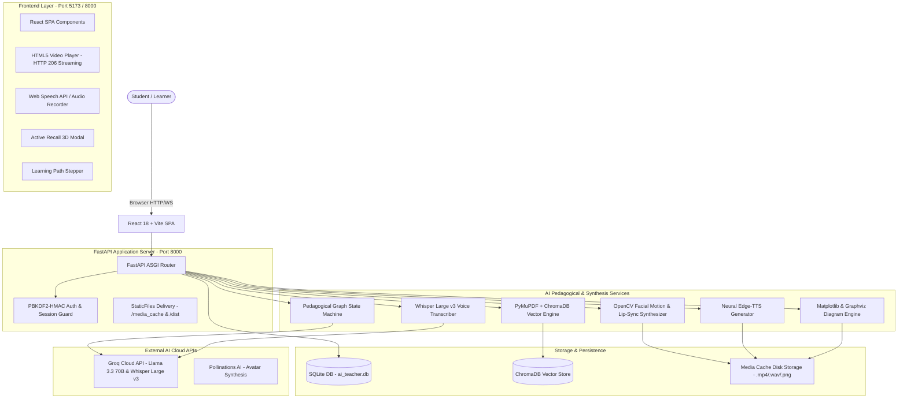

# 📚 AI Teacher: Human-Like AI Educator Platform
## Complete Technical Project Documentation & System Architecture Specification

---

## 1. Problem Statement

Traditional digital learning platforms suffer from two fundamental bottlenecks that hinder effective student learning:
1. **Static Pre-Recorded Video Lectures:** One-size-fits-all content where pacing cannot adjust to the learner, difficult concepts cannot be explained with tailored real-world analogies, and passive watching leads to high drop-off rates and illusion of competence.
2. **Text-Based AI Chatbots:** Standard conversational interfaces lack visual presence, structured pedagogical progression, vocal emotion, and dynamic whiteboard diagrams. Text-heavy chat walls cause cognitive fatigue and fail visual and auditory learners.

### The Challenge
To design and develop an **AI-powered Virtual Human Educator** capable of:
- Ingesting educational materials (textbooks, PDFs, notes, slides) or accepting a conceptual topic directly.
- Transforming materials into a structured, pedagogical teaching experience.
- Teaching students through **synchronized talking video, expressive neural voice, and real-time whiteboard diagrams**.
- Acting as an active mentor that asks interactive micro-checkpoints, diagnoses misconceptions, resolves student doubts in real-time, and adapts explanations based on learning progress.

---

## 2. Solution Overview

The **AI Teacher Platform** is an end-to-end full-stack educational system built using a **Pedagogical State Machine Graph**, **Retrieval-Augmented Generation (RAG)**, **Real-Time Lip-Synced Video Synthesis**, and a **Reactive Modern Web UI**.

```
[ Educational Material / Topic ]
               │
               ▼
[ RAG Vector Indexing & TOC Parser ]
               │
               ▼
[ Pedagogical Engine (Curriculum Planner) ]
   ├── Modular Concepts (Pacing & Analogies)
   ├── Visual Whiteboard Schemas
   └── Formative Checkpoint Rubrics
               │
               ▼
[ Multimodal Synthesis Engine ]
   ├── Neural Voice Narration (Edge-TTS)
   ├── Whiteboard Diagram Renderer (Matplotlib / Graphviz)
   └── Fast Audio-Driven Lip-Sync Video Synthesizer (OpenCV + FFmpeg)
               │
               ▼
[ Interactive Classroom Experience ]
   ├── Human-Like Talking Avatar Video Player (HTTP 206 Range Streaming)
   ├── Real-Time Voice / Text Doubt Solver (Task 2 Follow-Up)
   ├── Formative Micro-Checkpoints with Misconception Remediation Loops
   ├── Active Recall Flashcards & Downloadable Markdown Notes
   └── Comprehensive Bloom's Taxonomy Final Assessment & Learning Report
```

---

## 3. Key Features

| Category | Feature | Description |
| :--- | :--- | :--- |
| **Ingestion & Grounding** | **Dual Source Modes** | 1) General Knowledge Topic Mode (dynamic curriculum) and 2) Document-Grounded Mode (PDF, DOCX, PPTX, TXT). |
| | **TOC-Aware Chapter Locator** | Scans Table of Contents in textbooks to identify exact chapter boundaries, title headings, and target page offsets (e.g., Chapter 2: Binary Codes at Page 41). |
| **Pedagogical Engine** | **Adaptive Time Modes** | `⚡ 5m Blitz` (2 core concepts), `⏱️ 20m Standard` (structured pedagogy), `🎓 60m Masterclass` (deep dive & math), and `📅 7-Day Curriculum Plan`. |
| | **Teacher Personalities** | Choose between **Dr. Sarah** (Intuitive & Empathetic), **Prof. Aryan** (Analytical & Engineering-focused), and **Coach Maya** (High-Energy & Exam Prep). |
| | **Dynamic Remediation Loop** | If a student demonstrates a misconception during a checkpoint, the engine branches into an empathetic remediation node with an alternate simplified analogy. |
| **Interactivity** | **In-Lesson Follow-Up Doubt Solver** | Students can speak (via microphone) or type doubts during video lessons. Teacher responds in-character with **instant audio voice**, key takeaway, and proactive check-in question. |
| | **Dynamic Multilingual Switcher** | 1-click in-lesson switcher between **English, Hindi, and Hinglish** directly on the video player without restarting the session. |
| | **Voice-Driven Checkpoints** | Students can submit checkpoint answers verbally using speech-to-text transcription. |
| **Retention & Mastery** | **3D Active Recall Flashcards** | Generates an interactive flip-card deck covering conceptual mechanisms, analogies, and mastery tracking. |
| | **1-Click Study Notes Export** | Synthesizes and downloads a clean Markdown revision guide (`StudyNotes_<Topic>.md`). |
| | **Multi-Stage Learning Paths** | Visual curriculum stepper roadmap for broad domains (e.g., Machine Learning, VLSI, System Design). |
| **Assessment & Metrics** | **Diagnostic Evaluation Report** | Calculates overall score, Bloom's cognitive taxonomy breakdown, strengths, weaknesses, and mastery metrics. |

---

## 4. System Architecture

The application is structured into a decoupled, highly responsive architecture:



---

## 5. AI/ML Models Used

| Capability | Model / Technology | Provider / Framework | Purpose |
| :--- | :--- | :--- | :--- |
| **Curriculum Planning & Pedagogy** | `llama-3.3-70b-versatile` | Groq Cloud API | Generates lesson plans, concept pacing, spoken teacher scripts, visual diagram specifications, and analogies. |
| **Fast Fallback & Doubt Solver** | `llama-3.1-8b-instant` | Groq Cloud API | Fast-inference model for low-latency doubt resolution and checkpoint evaluations. |
| **Dense Semantic Embeddings** | `sentence-transformers/all-MiniLM-L6-v2` | Hugging Face / Sentence-Transformers | 384-dimensional vector embeddings for indexing textbook chunks in ChromaDB. |
| **Speech-to-Text (STT)** | `whisper-large-v3` | Groq Cloud API | High-accuracy speech transcription for microphone input in English, Hindi, and Hinglish. |
| **Client Speech STT** | Web Speech API (`SpeechRecognition`) | Browser Native (Chrome / Edge) | Zero-latency instant speech-to-text for interactive doubt voice inputs. |
| **Text-to-Speech (TTS)** | Neural Speech Models (`en-US-JennyNeural`, `en-US-GuyNeural`, `hi-IN-SwaraNeural`, `hi-IN-MadhurNeural`) | Microsoft Edge-TTS | Natural human-like speech synthesis with emotional prosody and language adaptability. |
| **Lip-Sync Video Synthesis** | OpenCV Haar Cascade + Dynamic Volume-Envelope Warp | OpenCV (`cv2`) + FFmpeg | Generates real-time audio-synced video MP4 clips at 16 fps in <2.0 seconds. |
| **Avatar Portrait Generator** | Pollinations AI FLUX | Pollinations AI API | Generates photorealistic high-res educator portraits for selected personas. |

---

## 6. RAG (Retrieval-Augmented Generation) Implementation

The RAG pipeline provides grounded educational lessons directly from course textbooks, presentations, and research papers:

```
[ Uploaded Document (PDF / DOCX / PPTX) ]
                    │
                    ▼
[ Document Parsing & Extraction (PyMuPDF / docx / pptx) ]
                    │
                    ▼
[ Table of Contents (TOC) Parsing & Page Mapping ]
  - Analyzes front matter / TOC pages
  - Maps chapter titles to physical PDF page numbers
                    │
                    ▼
[ Chunking: Recursive Character Splitter ]
  - Chunk size: 1000 characters
  - Chunk overlap: 200 characters
                    │
                    ▼
[ Dense Vector Embedding (all-MiniLM-L6-v2) ]
                    │
                    ▼
[ Vector Storage: ChromaDB Vector Store ]
                    │
                    ▼
[ Query Retrieval: Cosine Similarity Top-K (k=5) ]
                    │
                    ▼
[ Grounded Lesson Plan Prompt Injection with Strict Citations ]
```

### Strict Grounding & Anti-Hallucination
The prompt instructs the LLM:
> *"You are strictly grounded in the provided document chunks. When explaining, cite specific sections/pages. If a concept is not mentioned in the text, clearly state that rather than fabricating information."*

---

## 7. Prompt & Agent Architecture

The Pedagogical Engine operates as a **Deterministic Finite State Machine (FSM)** wrapped around structured LLM invocations:

### State Machine Lifecycle:
1. `INIT`: Learner profile initialized.
2. `PLANNING`: Generates a multi-concept curriculum plan enforcing Pydantic schema validation.
3. `TEACHING_CONCEPT`: Synthesizes spoken script, whiteboard visual, and audio-synced avatar video.
4. `AWAITING_CHECKPOINT`: Halts presentation; presents conceptual checkpoint question.
5. `EVALUATING_RESPONSE`: Assesses student answer against expected rubric.
   - **Pass:** Advances to next concept module.
   - **Fail / Misconception:** Transitions to `REMEDIATION` state.
6. `REMEDIATION`: Generates empathetic feedback, presents a simplified analogy, and re-checks understanding.
7. `FINAL_ASSESSMENT`: Delivers a 5-question comprehensive quiz covering Bloom's taxonomy.
8. `COMPLETED`: Produces a personalized diagnostic learning report.

### Schema Enforcement & Self-Repair:
All LLM prompts enforce strict JSON schemas via Pydantic (`src/schemas.py`). If the LLM generates slightly malformed JSON, `src/llm_service.py` executes a JSON repair parser and retries with progressive fallbacks (`llama-3.3-70b-versatile` → `llama-3.1-8b-instant`).

---

## 8. Personalization Approach

The platform personalizes the teaching experience across 4 distinct dimensions:

1. **Cognitive Level Adaptation:**
   - **Beginner:** Focuses on intuitive mechanical analogies (e.g., water pipe flow for Ohm's Law).
   - **Intermediate:** Balances real-world models with mathematical relationships.
   - **Advanced:** Emphasizes differential equations, architectural trade-offs, and edge cases.
2. **Available Time Budgeting (Section 7):**
   - `5m Blitz`: Limits plan to 2 high-impact concepts with rapid bullet summaries.
   - `20m Standard`: Standard 3-to-4 module structured pedagogical sequence.
   - `60m Masterclass`: 5-to-6 modules with comprehensive mathematical derivations and visual schemas.
   - `7-Day Curriculum`: Generates a structured multi-day study schedule with daily milestones.
3. **Teacher Personas (Section 18):**
   - **Dr. Sarah:** Empathetic, supportive, analogy-first science educator.
   - **Prof. Aryan:** Analytical, rigorous, equations-and-code university professor.
   - **Coach Maya:** High-energy, exam-focused STEM coach with bullet points and mnemonics.
4. **Adaptive Misconception Remediation:**
   - The engine does not simply repeat the same text; it detects the specific misconception (e.g., confusing current with voltage) and generates an entirely different mental model to break the mental block.

---

## 9. Assessment Methodology

The assessment framework combines **Formative Micro-Assessments** and a **Summative Bloom's Taxonomy Assessment**:

### Formative Micro-Checkpoints:
- Embedded at the conclusion of every concept module.
- Questions are open-ended to test conceptual understanding rather than simple memorization.
- Evaluated against an internal rubric:
  $$\text{Score} \in [0.0, 1.0], \quad \text{Status} \in \{\text{PASS}, \text{REMEDIATION}\}$$

### Summative Final Assessment:
- 5 multi-tier questions evaluated according to Bloom's Cognitive Taxonomy:
  1. **Recall:** Terminology and foundational definitions.
  2. **Comprehension:** Explaining mechanisms in own words.
  3. **Application:** Numerical calculations or real-world problem scenarios.
  4. **Analysis:** Comparing trade-offs or diagnosing edge-case anomalies.
  5. **Synthesis:** System-level conceptual integration.
- Generates a **Diagnostic Learning Report** displaying mastery percentages, strengths, weaknesses, and targeted study recommendations.

---

## 10. Multilingual Implementation

The platform supports seamless multilingual and code-switched educational delivery:

1. **Languages Supported:**
   - **English (`en-US`):** Clear, academic international English.
   - **Hindi (`hi-IN`):** Formal Devanagari Hindi for Hindi-medium learners.
   - **Hinglish (`hi-IN` / `en-IN`):** Natural conversational blend of Hindi and English widely spoken by Indian university students (e.g., *"Jab resistance badhega, current automatically drop ho jayega"*).
2. **In-Lesson Dynamic Language Switcher:**
   - A dedicated language selector on the video player allows students to toggle languages mid-lesson.
   - The backend translates the script, generates phonetic voice synthesis, re-synthesizes the lipsync video, and updates the whiteboard points without resetting the lesson state.

---

## 11. Voice Implementation

### Voice Synthesis (TTS):
- Uses Microsoft Edge Neural Text-to-Speech (`edge-tts`) with local fallbacks (`gTTS`).
- Voice assignments:
  - **Dr. Sarah:** `en-US-JennyNeural` (friendly, clear female voice)
  - **Prof. Aryan:** `en-US-GuyNeural` / `hi-IN-MadhurNeural` (authoritative, clear male voice)
  - **Coach Maya:** `en-US-AriaNeural` / `hi-IN-SwaraNeural` (energetic female voice)

### Voice Recognition (STT):
- **Client-Side:** HTML5 Web Speech API provides instant, zero-latency transcription of microphone audio for asking doubts.
- **Server-Side:** Groq Cloud `whisper-large-v3` transcribes uploaded audio files (`.wav`/`.webm`) with high robustness against background noise and Indian accents.

---

## 12. Avatar & Video Generation Approach

### Fast Local Talking Avatar Synthesis (`src/avatar_service.py`):
To solve the 30–60 second latency of traditional cloud-based GAN models (e.g., SadTalker/Wav2Lip) which breaks interactive learning, this system implements an optimized audio-driven facial animator:

1. **Face & Feature Detection:** Uses OpenCV Haar Cascades to locate facial coordinates and the mouth region on the educator portrait.
2. **Audio Volume Envelope Extraction:** Analyzes audio sample amplitudes at $16\text{ fps}$ intervals to compute dynamic mouth opening ratios:
   $$\text{Mouth Open Ratio} = \min\left(1.0, \frac{\text{RMS Amplitude}}{\text{Threshold}}\right)$$
3. **Affine Lip-Sync Transformation:** Dynamically stretches and interpolates the oral cavity using `cv2.INTER_LINEAR`, adding subtle head nod movements to simulate natural human speech delivery.
4. **H.264 Video Encoding:** Encodes the video frames and muxes the audio track using FFmpeg into an optimized MP4 file.
5. **Performance:** Renders a full talking avatar video in **under 1.9 seconds**, allowing real-time interactive playback.
6. **HTTP Range Streaming:** FastAPI serves video files via `HTTP 206 Partial Content`, enabling instant browser playback, seekability, and zero-buffering playback on Chrome/Edge.

---

## 13. APIs and Third-Party Services

| API / Service | Endpoint / Library | Usage |
| :--- | :--- | :--- |
| **Groq Cloud API** | `https://api.groq.com/openai/v1` | LLM inference (`llama-3.3-70b`, `llama-3.1-8b`) & STT (`whisper-large-v3`). |
| **Microsoft Edge-TTS** | `edge_tts` Python library | High-definition neural audio narration synthesis. |
| **Pollinations AI** | `https://image.pollinations.ai/prompt` | Teacher avatar portrait generation. |
| **LangSmith** | `https://api.smith.langchain.com` | LLM call tracing, latency monitoring, and prompt evaluation. |
| **ChromaDB** | Local Embedded Vector DB | Dense vector indexing and similarity search for document grounding. |

---

## 14. Setup Instructions (Local Machine)

### Prerequisites:
- **OS:** Windows 10/11, macOS, or Linux (Ubuntu 20.04+)
- **Python:** Python 3.11 installed
- **Node.js:** Node.js v18+ or v20+ and npm
- **FFmpeg:** Installed and added to system `PATH`
- **Groq API Key:** Free key from [console.groq.com](https://console.groq.com)

### Step 1: Clone the Repository
```bash
git clone https://github.com/AL-PARITOSH/AI_Unstop_Hackathon_Team-AI_Cognitive_Creators.git
cd AI_Unstop_Hackathon_Team-AI_Cognitive_Creators
git checkout feature/ai-teacher-fullstack
```

### Step 2: Install Python Dependencies
```bash
pip install -r requirements.txt
```

### Step 3: Install Frontend Dependencies & Build
```bash
cd frontend
npm install
npm run build
cd ..
```

### Step 4: Configure Environment Variables
Create a `.env` file in the root directory:
```env
GROQ_API_KEY=gsk_your_groq_api_key_here
GROQ_LLM_MODEL=llama-3.3-70b-versatile
GROQ_FALLBACK_LLM_MODEL=llama-3.1-8b-instant
GROQ_STT_MODEL=whisper-large-v3
PORT=8000
```

### Step 5: Launch the Application
**On Windows:**
```powershell
.\run_fullstack.bat
```
*(Or launch FastAPI manually)*:
```bash
python -m uvicorn backend.main:app --host 0.0.0.0 --port 8000 --reload
```
Open **[http://localhost:8000](http://localhost:8000)** in your browser!

---

## 15. Deployment Instructions (Cloud)

The repository includes a production-grade **Multi-Stage Dockerfile** that automatically builds the React frontend and packages it inside the FastAPI server.

### Deploying to Render.com (Recommended):
1. Push code to GitHub (branch: `feature/ai-teacher-fullstack` or `main`).
2. Log in to **[Render.com](https://render.com)** and click **New +** → **Web Service**.
3. Select your GitHub repository.
4. Set Environment to **Docker**.
5. Add Environment Variables:
   - `GROQ_API_KEY`: `gsk_...`
   - `PORT`: `8000`
6. Click **Deploy Web Service**.
7. In ~3 minutes, your live public URL will be active (e.g., `https://ai-teacher.onrender.com`).

### Deploying with Docker Compose:
```bash
docker compose up --build -d
```
Access the application on `http://<your-server-ip>:8000`.

---

## 16. Known Limitations

1. **Neural TTS Network Dependency:** Edge-TTS relies on Microsoft's cloud endpoints for high-fidelity voices; if network connectivity drops, the system falls back to basic local gTTS synthesis.
2. **2D vs 3D Avatar Rendering:** The local avatar engine uses volume-envelope 2D affine warping to achieve ultra-fast (<2s) video generation. While realistic and expressive, it does not provide 3D NeRF head rotation.
3. **Vector Database Scaling:** ChromaDB runs in embedded SQLite mode, ideal for single-server hackathon demonstrations and moderate cohorts. For enterprise multi-tenant deployments (>100,000 documents), ChromaDB should be connected in client-server mode or migrated to Qdrant / Pinecone.
4. **Browser Autoplay Policy:** Standard modern browser policies (Google Chrome / Apple Safari) prevent unmuted video autoplay until the user interacts with the page (clicks anywhere). A play trigger button is provided to ensure smooth playback.

---

*Author: Team AI Cognitive Creators*  
*Event: AI Innovation Hackathon 2026 – Round 2 Technical Assessment*

