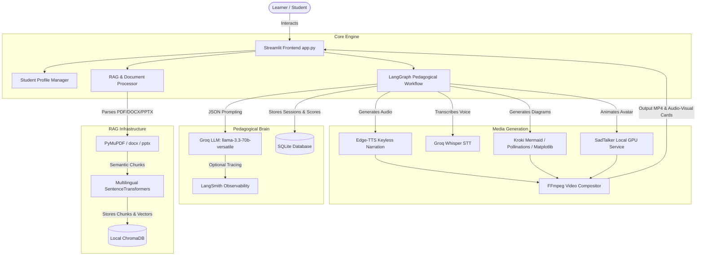

# AI Teacher — Adaptive Multilingual Video Learning Assistant

**AI Teacher** is a full-stack, hackathon-ready, multi-sensory educational assistant that transforms static learning materials (PDF, DOCX, PPTX, TXT, MD) or broad academic topics into interactive, personalized, voice-narrated video lessons.

---

## 1. Hackathon Requirement Coverage Table

| Requirement | Code Module | Implementation Detail | Fallback / Degradation Mode |
|---|---|---|---|
| **1. Learning from Uploaded Materials** | `src/rag_service.py` | PyMuPDF, python-docx, python-pptx, semantic chunking, metadata indexing in ChromaDB | Topic-based teaching mode |
| **2. Topic-Based Teaching** | `src/pedagogy_graph.py` | Groq LLM curriculum generation without fake RAG citations | General knowledge LLM prompting |
| **3. AI Lesson Structure** | `src/schemas.py`, `src/prompts.py` | Logical concept breakdown, prerequisites, duration-aware time budget | Default 3-concept standard plan |
| **4. Personalized Teaching** | `src/schemas.py`, `src/database.py` | `StudentProfile` (class level, prior knowledge, goal, teaching style, duration) | Default high school beginner profile |
| **5. Human-Like Teaching** | `src/pedagogy_graph.py` | Progressive flow: Understand → Explain → Demonstrate → Checkpoint → Remediation → Assessment | Linear concept progression |
| **6. Video-Based AI Presentation** | `src/compositor.py` | 1280x720 split video (65% visual whiteboard, 35% teacher avatar, burned SRT subtitles) | Audio + Animated Visual Panel Card |
| **7. AI Voice** | `src/tts_service.py` | Edge-TTS with `hi-IN-SwaraNeural`, `hi-IN-MadhurNeural`, `en-IN-NeerjaNeural`, `en-IN-PrabhatNeural` | HTML5 Audio synthesis / Text script |
| **8. Human-Like Avatar** | `src/avatar_service.py` | SadTalker local CLI wrapper (`inference.py --driven_audio ... --source_image ...`) | High-res Teacher Avatar Card |
| **9. Multilingual Capability** | `src/prompts.py`, `src/tts_service.py` | English, Hindi (Devanagari), Hinglish script generation and TTS mapping | English default |
| **10. Student Questioning & Assessment** | `src/schemas.py`, `src/pedagogy_graph.py` | Checkpoint questions per concept + Final comprehensive quiz (MCQ, short answer, reasoning) | Standard MCQ quiz |
| **11. Adaptive Remediation** | `src/pedagogy_graph.py` | Misconception identification, alternate water-flow analogies, max 2 remediation retries | Direct answer feedback |
| **12. Working Application** | `app.py`, `src/ui_components.py` | Complete interactive Streamlit UI with state preservation across tabs & restarts | Full local execution |
| **13. RAG Grounding & Citations** | `src/rag_service.py` | Exact `[Document — Page N]` citations, `<retrieved_source>` prompt boundary protection | `insufficient_source_evidence` fallback |
| **14. Speech-to-Text Answer Input** | `src/stt_service.py` | Groq Whisper `st.audio_input` audio transcription | Local `faster-whisper` / Typed text |
| **15. Subject-Aware Visuals** | `src/visual_service.py` | Math formulas, physics circuits/plots, CS code cards, history timelines, biology structure diagrams | Matplotlib concept card |
| **16. Observability** | `src/llm_service.py` | LangSmith auto-tracing when `LANGSMITH_API_KEY` is present | Disabled silently without error |
| **17. Demo Mode** | `src/demo_seed.py` | Pre-loaded Ohm's Law scenario with intentional misconception test and instant simulation | Live full pipeline |

---

## 2. Mermaid Architecture Diagram



---

## 3. API Key & Credential Matrix

| Key / Tool Name | Mandatory / Optional | Purpose | Free Tier / Keyless Status |
|---|---|---|---|
| `GROQ_API_KEY` | **Required** | LLM pedagogical reasoning (`llama-3.3-70b-versatile`) & Whisper STT | Free Developer Tier Available |
| `LANGSMITH_API_KEY` | Optional | LLM tracing and observability | Free Tier Available (App works without key) |
| `POLLINATIONS_API_KEY` | Optional | Educational image illustrations | Keyless Public API / Optional Key |
| `Edge-TTS` | **Built-in** | Multilingual audio narration | 100% Free Keyless Service |
| `ChromaDB` | **Built-in** | Local vector store for document RAG | 100% Free Local Open Source |
| `SQLite` | **Built-in** | Persistent student profile and session history | 100% Free Local Database |
| `FFmpeg` | Optional System Tool | Video composition (Left visual, right avatar, subtitles) | 100% Free Open Source CLI |

---

## 4. Setup & Running Instructions

### Windows / macOS / Linux

1. **Clone & Environment Setup:**
   ```bash
   git clone <repository_url>
   cd final
   python -m venv venv
   # On Windows:
   venv\Scripts\activate
   # On macOS/Linux:
   source venv/bin/activate
   ```

2. **Install Dependencies:**
   ```bash
   pip install -r requirements.txt
   ```

3. **Configure Secrets & Environment:**
   Ensure `.streamlit/secrets.toml` or `.env` contains your keys:
   ```toml
   GROQ_API_KEY = "gsk_..."
   GROQ_LLM_MODEL = "llama-3.3-70b-versatile"
   LANGSMITH_API_KEY = "lsv2_pt_..."
   ```

4. **Launch Application:**
   ```bash
   streamlit run app.py
   ```
   Open `http://localhost:8501` in your browser.

5. **Run Unit Tests:**
   ```bash
   python -m unittest tests/test_all.py
   ```

---

## 5. Hackathon 3–7 Minute Demo Script

1. **Step 1: Introduction & System Status (0:00 - 0:45)**
   - Open Streamlit app.
   - Show the visible **Stepper Bar** (`Profile -> Source -> Lesson Plan -> Learn -> Checkpoints -> Assessment -> Report`).
   - Expand `System Status` in sidebar to demonstrate active Groq LLM, Edge TTS, and ChromaDB.

2. **Step 2: Onboarding & Source Input (0:45 - 1:45)**
   - Select **Learner Profile**: Set language to `Hinglish` and duration to `20 Mins`.
   - Select **Source & Topic**: Click `⚡ Launch Ohm's Law Demo Scenario` or upload a PDF chapter.

3. **Step 3: Interactive Lesson & Voice/Visual Presentation (1:45 - 3:30)**
   - View Concept 1: *Voltage, Current, and Resistance Fundamentals*.
   - Listen to the **Edge TTS audio narration** in Hinglish.
   - Inspect the **Matplotlib coordinate graph** showing $V = I \times R$.
   - Open the **Retrieved Document Sources & Citations** expander showing exact `[Document Name — Page N]` citations.

4. **Step 4: Checkpoint Question & Misconception Remediation (3:30 - 5:00)**
   - Navigate to **Checkpoints**.
   - Read the question: *"If voltage V remains constant and resistance R increases, what happens to current I?"*
   - Click `⚡ Test Incorrect Answer Misconception Scenario` (submits *"Current increases."*).
   - Observe the **AI Diagnostic Evaluator**:
     - Detects misconception: *"Confusing inverse proportionality"*.
     - Provides empathetic feedback and triggers **Adaptive Remediation**.
     - Explains the **Water Pipe Analogy** and renders a NEW formula visual card.
     - Asks a targeted re-check question.

5. **Step 5: Assessment, Learning Report, & Next Topic (5:00 - 6:30)**
   - Navigate to **Assessment & Report**.
   - Complete the final quiz.
   - View the generated **Learning Report**: Score breakdown, strong areas, weak areas, and 7-day revision schedule.
   - Click `📥 Download Learning Report (Markdown)`.

---

## 6. Pre-Demo Audit Checklist

- [x] Topic can be taught without an uploaded file (General Topic Mode)
- [x] PDF, DOCX, PPTX, TXT, and MD can be ingested and chunked
- [x] ChromaDB vector retrieval displays exact document page citations
- [x] Edge-TTS generates clear audio narration for Hindi, Hinglish, and English
- [x] Subject-aware visual generated for each concept (diagram, formula, graph, code)
- [x] Checkpoint questions detect student misconceptions and trigger finite remediation
- [x] Remediation retries capped at max 2 per concept to prevent infinite loops
- [x] Full persistent storage in SQLite supporting `Resume Last Lesson`
- [x] System degrades gracefully if optional keys or heavy tools (SadTalker/FFmpeg) are missing
- [x] Unit test suite passes cleanly (`tests/test_all.py`)

---

## 7. Responsible AI & Privacy Note

- **Untrusted Input Protection**: Uploaded documents are wrapped in prompt boundaries (`<retrieved_source>`) and treated strictly as passive academic reference data. Embedded instructions within documents are ignored.
- **Avatar Ethics**: AI avatar representations use fictional, generated, or user-authorized assets. Real-person impersonation without explicit authorization is strictly prohibited.
